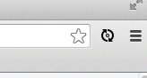

bunnyhill
=========

Resources and practice for JavaScript developers getting started with the **MEAN** stack.

**M:** [MongoDB](http://www.mongodb.org/) Open-source NoSQL document database.

**E:** [Express](http://expressjs.com/) Web Application Framework for Node.

**A:** [Angular](http://angularjs.org/) JavaScript MVC Framework for the client side.

**N:** [Node](http://nodejs.org/) JavaScript for the server side. A platform built on [Chrome's JavaScript runtime](https://code.google.com/p/v8/).

The following documentation will walk you through the steps of setting up your development environment and getting up and running with the sample project in this repo.
The section on [Learning Resources](#learning-resources) provides links to learn more about each of the tools and technologies used.
Also specifically for Java Developers, see the [section](#java-comparison) on comparisons.

## Tooling: Setup Your Development Environment
* Install [MongoDB](http://docs.mongodb.org/manual/installation/)
* Install [Sublime Text 2](http://www.sublimetext.com/2)
* Install [Node.js](http://nodejs.org/). This will automatically also install [npm](https://npmjs.org/), the official package manager for Node.js.
* Install [Git](http://git-scm.com/downloads)
* Install [Batarang](https://chrome.google.com/webstore/detail/angularjs-batarang/ighdmehidhipcmcojjgiloacoafjmpfk?hl=en), a Chrome extension to debug Angular applications.

### Optional Tools
* If you prefer to use a GUI for Git version control, install [SourceTree](http://www.sourcetreeapp.com/). *Bonus: It also works for BitBucket/Mercurial repos.*
* If you prefer to use a GUI for inspecting and managing your Mongo database, install [Robomongo](http://robomongo.org/)

## Install Node Modules
Now that you have node installed, open a terminal window (Mac/Linux) or command window (Windows) and run these commands to install node modules globally.
Mac/Linux users may require each command preceded by ```sudo```.
Windows users may need to open the the command window as Administrator.
	
	```
	npm install -g nodemon
	npm install -g karma
	npm install -g grunt-cli
	npm install -g bower
	npm install -g yo
	npm install -g generator-angular
	```

## Project Setup
1. If you don't already have one, [Sign up for a Github account](https://github.com/). Strictly speaking, you don't need one just to clone a repo, but you will need an account to create your own repos and collaborate with others.
1. Open a terminal or command window and ```cd``` to your ```projects``` directory. The remaining steps are to be run at the command line.
1. ```git clone https://github.com/danielabar/bunnyhill.git```
1. ```cd bunnyhill```
1. ```npm install```
1. ```cd dbinit```
1. ```mongoimport -d langfun -c decks --type json --jsonArray --drop decks.json```
1. ```mongoimport -d langfun -c scores --type json --jsonArray --drop scores.json```
1. ```cd ..```
1. ```grunt test```
1. ```nodemon server.js``` Nodemon will watch for file changes and automatically redeploy so you never need to restart your Node server.
1. Launch a browser and enter [http://localhost:3000](http://localhost:3000)

## Configure Project Settings
* Open Sublime Text 2
* File -> Open, navigate to projects/bunnyhill and open the folder
* Project -> Save Project As
* Enter filename ```bunnyhill.sublime-project``` (it will be ignored by git, this is good for now)
* Edit the file so it looks like this:

	```
		{
		"folders": [{
			"path": "<path to your project here, it will already be filled in for you>"
		}],
		"settings": {
			"tab_size": 2,
			"detect_indentation": false,
			"translate_tabs_to_spaces": false,
			"use_tab_stops": true	
		}
	}
	```

## Using LiveReload
Follow these steps to have changes to html, css and client side js files automatically reflected in the browser without manually clicking refresh.

1. Install the [Chrome LiveReload extension](https://chrome.google.com/webstore/detail/livereload/jnihajbhpnppcggbcgedagnkighmdlei?hl=en)
1. ```grunt watch```  This will start a livereload server on port 35729, and watch for changes to files specified in the ```watch``` section of Gruntfile.js.
	* Alternatively, you can also run ```grunt watch --verbose``` to see the list of files that are being watched

1. Launch Chrome and enter [http://localhost:3000](http://localhost:3000)
1. Click on the livereload icon in the Chrome toolbar (see screenshot below)



You can now go back to sublime, edit any client side html, css or js. As soon as you save the changes, they will automatically be reloaded in the browser.

## <a name="learning-resources"/>Learning Resources
* [Git Simple Guide](http://rogerdudler.github.io/git-guide/) Just the basics, get started quickly.
* [Pro Git e-book](http://git-scm.com/book) A free e-book on Git, from basic introduction to advanced topics.
* [Sublime Text 2 Free Video Course](http://net.tutsplus.com/articles/news/perfect-workflow-in-sublime-text-free-course/) A series of short screencasts to learn how to use Sublime, some very cool features.
* [Sublime Text 2 Unofficial Documentation](http://sublime-text-unofficial-documentation.readthedocs.org/en/sublime-text-2/)
* [Angular Phonecat Tutorial](http://docs.angularjs.org/tutorial) Build a phone catalogue app with Angular. Excellent step-by-step instructions and explanation of Angular concepts.
* [The Art of Node](https://github.com/maxogden/art-of-node) A short introduction to Node.js
* [Express Guide](http://expressjs.com/guide.html)
* [The Little MongoDB Book](http://openmymind.net/mongodb.pdf)
* [Yeoman Angular Generator](https://github.com/yeoman/generator-angular) Used by this project to scaffold and add Angular components such as routes, controllers, services and directives.
* [Yeoman, Grunt and Bower](http://yeoman.io/) Tooling used to manage the client side.

### <a name="java-comparison"/>For those coming from the Java world...
* [npm](https://npmjs.org/) is roughly analogous to [Maven](http://maven.apache.org/)
* [Grunt](http://gruntjs.com/) is a task manager similar to [Ant](http://ant.apache.org/)
* [Yeoman](http://yeoman.io/) is a scaffolding tool, sort of like [Maven Archetype](http://maven.apache.org/guides/introduction/introduction-to-archetypes.html)
* [Express.js](http://expressjs.com/) is (very rough comparison here) like [Spring MVC](http://docs.spring.io/spring/docs/3.2.x/spring-framework-reference/html/mvc.html), at least in exposing routes. For the Rails folks, a more apt comparison is Express is to Node what Sinatra is to Rails.

## Animations
The yeoman angular generator installs Angular 1.0.8. However, to use animations, this project has been upgraded to [Angular 1.2.1](http://code.angularjs.org/1.2.1/docs/api).
Also [animate.css](https://daneden.me/animate/) has been added to make use of super cool keyframe animations. 
To learn more about Angular and animations, see:
* [Remastered Animation in Angular 1.2](http://www.yearofmoo.com/2013/08/remastered-animation-in-angularjs-1-2.html)
* [Get Moving with Angular 1.2 Animation and Animate.css](http://www.divshot.com/blog/tips-and-tricks/angular-1-2-and-animate-css/)